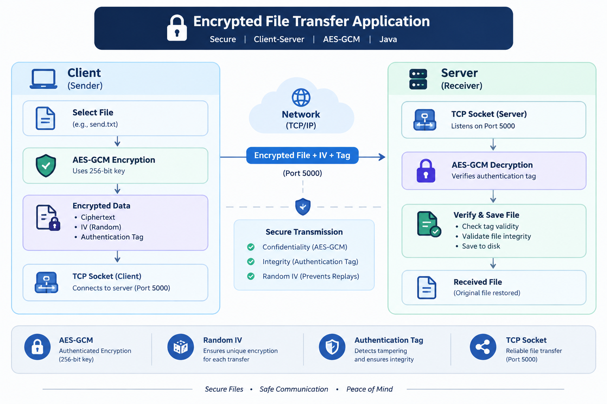
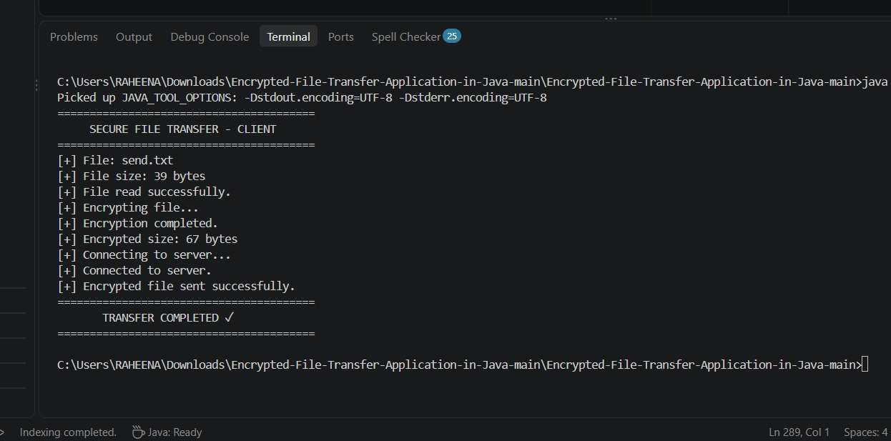
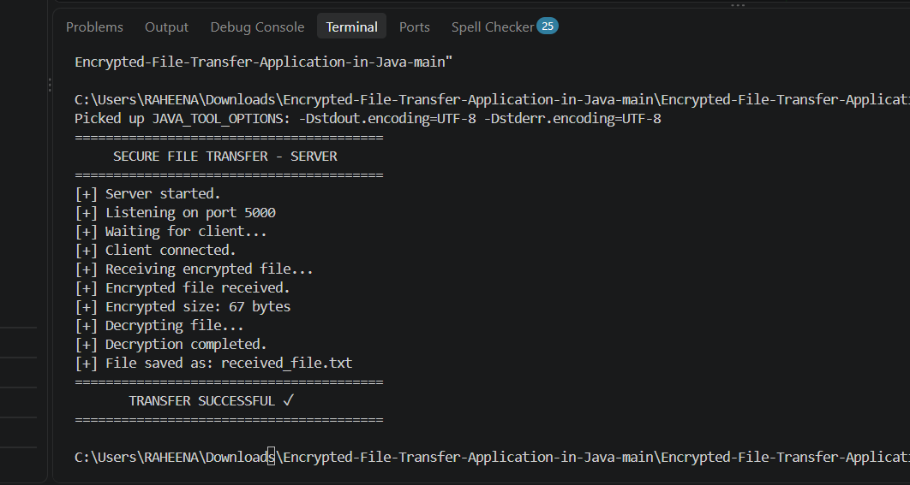
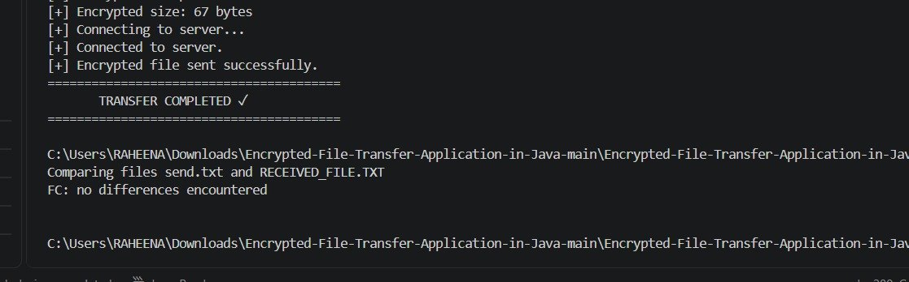

# 🔐 Encrypted File Transfer Application in Java

A secure client-server file transfer application built using **Java Socket Programming** and **AES-GCM authenticated encryption**.

The application demonstrates how a file can be securely encrypted on the client side, transferred over a TCP connection, decrypted on the server side, and verified to ensure that the received file matches the original file.

---

## 📌 Project Overview

Traditional file transfer over a network can expose sensitive data if the transmitted information is not protected.

This project implements a secure file transfer mechanism where:

1. The client reads the file.
2. The file is encrypted using **AES-128-GCM**.
3. A random initialization vector (IV) is generated for every transfer.
4. The encrypted data is sent through a TCP socket.
5. The server receives the encrypted data.
6. The server decrypts the data using the shared encryption key.
7. The decrypted file is saved as `received_file.txt`.
8. The original and received files are compared to verify successful transfer.

---

## ✨ Features

- 🔐 AES-GCM authenticated encryption
- 🔑 AES-128 encryption using a 128-bit key
- 🎲 Random 12-byte IV generated for every encryption
- 🛡️ Authentication tag for detecting unauthorized modification
- 🌐 TCP client-server communication
- 📁 Secure file transfer
- 🔄 Automatic encryption and decryption
- ✅ File integrity verification
- ⚠️ Handling of invalid or modified encrypted data
- 🚫 Protection against oversized transfer payloads
- 💻 Simple command-line interface
- 📚 Demonstrates Java networking and cybersecurity concepts

---

## 🏗️ Architecture



### Communication Flow

```text
Original File
     │
     ▼
┌───────────────┐
│     Client    │
└───────┬───────┘
        │
        ▼
   AES-128-GCM
 Encryption
        │
        ├── Random IV
        └── Authentication Tag
        │
        ▼
   TCP Socket
        │
        ▼
┌───────────────┐
│     Server    │
└───────┬───────┘
        │
        ▼
AES-GCM Decryption
        │
        ▼
received_file.txt
        │
        ▼
File Verification
```

---

## 🔐 Security

### AES-GCM Encryption

The project uses:

```text
AES/GCM/NoPadding
```

AES-GCM provides both:

- **Confidentiality** — protects the contents of the file from being read by unauthorized parties.
- **Integrity and authentication** — unauthorized modification of encrypted data causes authenticated decryption to fail.

### Initialization Vector (IV)

A fresh **12-byte random IV** is generated for every encryption operation.

The IV is stored together with the encrypted data:

```text
[ IV ][ Ciphertext + Authentication Tag ]
```

The IV does not need to be secret because it is required by the receiver to perform decryption.

### Authentication Tag

AES-GCM generates an authentication tag along with the ciphertext.

The server verifies this tag during decryption. If the encrypted data has been modified, authenticated decryption fails.

---

## ⚠️ Key Management

For demonstration purposes, the application currently uses a shared AES-128 key stored in the source code.

This is suitable for demonstrating the encryption and transfer workflow but is **not recommended for production systems**.

A production implementation should use a secure key-management mechanism such as:

- Environment variables
- Secure key storage
- Password-based key derivation
- Public-key cryptography
- ECDH-based key exchange
- RSA/ECC-based secure key exchange
- Hardware-backed key management

---

## 📂 Project Structure

```text
Encrypted-File-Transfer-Application-in-Java/
│
├── src/
│   ├── AESUtil.java
│   ├── Client.java
│   └── Server.java
│
├── docs/
│   ├── Secure_File_Transfer_Report.pdf
│   ├── architecture.png
│   └── screenshots/
│       ├── client.png
│       ├── server.png
│       └── verification.png
│
├── send.txt
├── README.md
├── LICENSE
└── .gitignore
```

---

## 📸 Demo

### 1. Client — Encryption & File Transfer

The client reads the original file, encrypts it using AES-GCM, establishes a TCP connection with the server, and sends the encrypted data.



---

### 2. Server — Decryption & File Reception

The server receives the encrypted payload, decrypts it using AES-GCM, and saves the resulting file as `received_file.txt`.



---

### 3. File Integrity Verification

The original `send.txt` and decrypted `received_file.txt` are compared using the Windows `fc` command.



The verification result:

```text
FC: no differences encountered
```

This confirms that the received file matches the original file.

---

## ⚙️ Technologies Used

| Technology | Purpose |
|---|---|
| Java | Application development |
| Java Socket Programming | Client-server communication |
| TCP/IP | Reliable network communication |
| AES-128-GCM | Authenticated encryption |
| Java Cryptography Architecture | Encryption and decryption |
| File I/O | Reading and writing files |
| Git | Version control |
| GitHub | Source code hosting |

---

## 🧩 Main Components

### `AESUtil.java`

Responsible for:

- AES-GCM encryption
- AES-GCM decryption
- Random IV generation
- Authentication tag verification

---

### `Client.java`

Responsible for:

- Reading `send.txt`
- Encrypting the file
- Connecting to the server
- Sending encrypted data
- Displaying transfer status

---

### `Server.java`

Responsible for:

- Starting the server socket
- Accepting client connections
- Receiving encrypted data
- Validating the received payload
- Decrypting the data
- Saving `received_file.txt`
- Handling authentication/decryption failures

---

## 🚀 How to Run

### Prerequisites

Install:

- Java JDK 17 or later
- Git
- VS Code or any Java-compatible IDE

Verify Java installation:

```cmd
java -version
```

Verify Java compiler:

```cmd
javac -version
```

---

## ▶️ Step 1 — Clone the Repository

```cmd
git clone https://github.com/P188-raheena/Encrypted-File-Transfer-Application-in-Java.git
```

Move into the project:

```cmd
cd Encrypted-File-Transfer-Application-in-Java
```

---

## ▶️ Step 2 — Compile the Project

```cmd
javac src\AESUtil.java src\Client.java src\Server.java
```

If compilation is successful, the Java `.class` files will be generated inside the `src` directory.

---

## ▶️ Step 3 — Start the Server

Open **Terminal 1**:

```cmd
java -cp src Server
```

The server will start listening on:

```text
localhost:5000
```

---

## ▶️ Step 4 — Start the Client

Open **Terminal 2**.

Make sure `send.txt` exists in the project root directory.

Then run:

```cmd
java -cp src Client
```

The client will:

```text
Read File
   ↓
Encrypt File
   ↓
Connect to Server
   ↓
Send Encrypted Data
```

---

## ▶️ Step 5 — Verify the Received File

After successful transfer, the server creates:

```text
received_file.txt
```

Compare the files using:

```cmd
fc send.txt received_file.txt
```

Expected result:

```text
FC: no differences encountered
```

---

## 🧪 Test Result

The application was tested successfully using a sample file.

### Test Details

```text
Original file size      : 39 bytes
Encrypted payload size  : 67 bytes
Transfer protocol       : TCP
Encryption              : AES-128-GCM
IV size                 : 12 bytes
Authentication tag      : 128-bit
```

The server successfully:

- Received the encrypted payload
- Decrypted the file
- Created `received_file.txt`
- Passed file comparison verification

Result:

```text
FC: no differences encountered
```

---

## 🛡️ Error Handling

The application includes handling for several failure conditions, including:

- File not found
- Invalid encrypted data length
- Oversized payloads
- Server connection failures
- Port already in use
- AES-GCM authentication failures
- Invalid or modified ciphertext
- Network transfer errors

If encrypted data is modified, AES-GCM authenticated decryption can fail with an authentication/tag verification error.

---

## ⚠️ Current Limitations

This project is designed primarily as an educational demonstration of secure file transfer.

Current limitations include:

- Shared encryption key is stored in the source code
- Files are currently loaded into memory
- Single-client transfer workflow
- Command-line interface
- Localhost testing by default
- No user authentication
- No encrypted key exchange
- No transfer history
- No graphical user interface

---

## 🚀 Future Enhancements

The project can be extended with:

### 🔑 Secure Key Exchange

Implement:

- ECDH
- RSA
- ECC

to securely establish encryption keys between client and server.

### 📦 Large File Streaming

Instead of loading the complete file into memory, implement buffered streaming for large files.

### 📊 Transfer Progress

Add a progress indicator such as:

```text
[██████████████████░░] 90%
```

### 👥 Multiple Clients

Allow the server to handle multiple clients using:

- Threads
- ExecutorService
- Thread pools

### 👤 User Authentication

Add secure login/authentication before allowing file transfers.

### 🖥️ Graphical User Interface

Build a JavaFX interface with:

- File selection
- Encryption status
- Transfer progress
- Connection status
- Transfer history

### 🔒 Advanced Security

Future versions can include:

- Secure key storage
- Digital signatures
- Certificate-based authentication
- TLS
- Secure key exchange
- Password-based key derivation

---

## 📈 Possible Production Architecture

A more advanced production version could follow:

```text
Client
   │
   ├── User Authentication
   │
   ├── Secure Key Exchange
   │
   ▼
Encrypted File
   │
   ▼
TLS / Secure TCP Connection
   │
   ▼
Server
   │
   ├── Authentication
   ├── File Validation
   ├── Decryption
   └── Secure Storage
```

---

## 🎯 Learning Outcomes

This project helped demonstrate practical concepts in:

- Java Socket Programming
- Client-server architecture
- TCP/IP networking
- File handling
- Symmetric encryption
- AES-GCM authenticated encryption
- Initialization vectors
- Authentication tags
- Exception handling
- Secure data transmission
- File integrity verification
- Git and GitHub
- Basic cybersecurity principles

---

## 📄 Project Documentation

A detailed project report is available here:

```text
docs/Secure_File_Transfer_Report.pdf
```

The report contains information about:

- Project objectives
- System architecture
- Encryption methodology
- Network communication
- Implementation
- Testing
- Security considerations
- Future enhancements

---

## 🔗 Repository

GitHub:

https://github.com/P188-raheena/Encrypted-File-Transfer-Application-in-Java

---

## 👩‍💻 Author

**Raheena**

BTech Computer Science and Engineering — CSM

---

## 📜 License

This project is licensed under the **MIT License**.

See the `LICENSE` file for details.

---

## ⭐ Acknowledgment

This project was developed as an educational implementation to understand the integration of:

**Java Networking + Cryptography + Secure File Transfer**

It demonstrates how encryption and authenticated communication can be incorporated into a client-server application.
